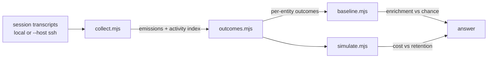

<!-- Generated from skills-src/git-span/hook-effect-analysis/SKILL.md.eta by scripts/build-agent-skills.mjs — do not edit; change the template and rebuild. -->

# hook-effect-analysis

Someone asking "is this hook earning its tokens?" should get an answer in an afternoon, not a week spent rebuilding transcript-joining machinery and re-discovering the same measurement bugs. This skill is a four-tool pipeline over Claude Code session transcripts:



None of the four scripts contain the string "span" or any knowledge of what a hook's output means — every hook-specific behavior is injected through an `--extract=<module-path>` module. Scope: Claude Code transcripts only (`~/.claude/projects/**/*.jsonl` or the same shape on a remote host); Codex session transcripts are not confirmed to share this JSONL layout and are out of scope.

**On this host**, that scope note means the pipeline analyzes a *recorded Claude Code transcript corpus* as data — pointed at a directory or remote host that holds one. It does not measure this host's own sessions: this host does not record transcripts in that JSONL shape, so there is nothing here for the tools to collect from your current environment unless such a corpus exists.

## The four tools

### `scripts/collect.mjs`

The single transcript-parsing choke point. Walks the transcript store once and writes two intermediates that every other tool reads instead of re-parsing:

```
node scripts/collect.mjs [--root=<path>] [--host=<ssh-host>] [--hook=<name>...] [--out=<path>] [--activity-out=<path>]
```

- `--root=<path>` — local transcript root (default `~/.claude/projects`)
- `--host=<ssh-host>` — read transcripts from a remote host instead; resolves the remote root to an absolute path before globbing and reports an ssh/tar failure distinctly from a genuinely empty corpus (see `references/measurement-pitfalls.md`)
- `--hook=<name>` — repeatable; only emissions from this `attachment.hookName`. Default: every hook seen — filtering by hook name is the caller's job
- `--out=<path>` / `--activity-out=<path>` — override the default output locations (alongside the script)

### `scripts/outcomes.mjs`

Joins emissions to later activity, per extracted entity, with the three corrections applied structurally — there is no way to call this tool and get an uncorrected number:

```
node scripts/outcomes.mjs --extract=<module-path> [--emissions=<path>] [--activity=<path>] [--out=<path>]
```

`--extract` is required and points at a `.mjs` module whose default export is `(emittedText) => string[]` — repo-relative entity paths pulled out of a hook's emitted text. See `scripts/extractors/git-span.mjs` for a runnable example.

### `scripts/baseline.mjs`

**Required reading before quoting any raw rate from `outcomes.mjs`'s output.** A raw hit rate is uninterpretable on its own — in the analysis that motivated this skill, a figure that looked like a strong effect turned out to be about 1.3x chance. This tool samples a placebo pool of paths the hook never mentioned from the same project and reports the enrichment ratio:

```
node scripts/baseline.mjs [--outcomes=<path>] [--emissions=<path>] [--activity=<path>] [--placebo-multiplier=<k>] [--min-records-left=<n>] [--seed=<n>]
```

Do not report "surfaced entities were touched at N%" without also running this and reporting the enrichment ratio alongside it.

### `scripts/simulate.mjs`

Costs a proposed suppression policy before anyone builds it — characters saved vs. outcomes retained, never applied to already-collected data as a fait accompli:

```
node scripts/simulate.mjs --extract=<module-path> [--policy=<module-path>] [--outcomes=<path>] [--emissions=<path>]
```

`--extract` here must additionally export a named `anchors(emittedText) => [{section, entity, line}]` (line-level detail `outcomes.mjs`'s simpler contract doesn't need). `--policy` points at a `.mjs` module whose named exports are `(section, anchor) => boolean` predicates; default is `scripts/policies/default.mjs`, a small built-in set for a smoke test.

## Worked example: the git-span touch hook

```bash
cd scripts
node collect.mjs --hook=PostToolUse:Read --hook=PreToolUse:Read
node outcomes.mjs --extract=extractors/git-span.mjs
node baseline.mjs
node simulate.mjs --extract=extractors/git-span.mjs
```

`extractors/git-span.mjs` parses the `<git-span>` block's anchor list — both the current box-drawing tree format and the older flat-bullet format — into repo-relative paths. It is the only git-span-specific code in this skill; everything upstream and downstream of it is hook-agnostic and works unmodified for a hook nobody has written yet.

Pointed at this repo's own local transcripts, this reproduces the shape of the original analysis's headline figures (they will not match exactly — the corpus has grown since): a placebo enrichment around 1.2-1.3x, and a self-reference/ordering/censoring-corrected touch rate well below a naive join's inflated figure.

## Failure modes handled by design

- Empty or malformed `attachment.stdout` never crashes `collect.mjs`; it's recorded as `stdout: null` and `outcomes.mjs` skips entity extraction for it, not the whole run.
- A `--host` failure (bad key, dead host, missing `tar`) exits non-zero with a distinct message from "found zero transcripts."
- Running these tools invoked by a human as a one-shot CLI; concurrent runs writing to the same default intermediate path are not a concern this skill handles.

## Out of scope

Not a dashboard, not a live monitor, and not a replacement for instrumenting a hook to log its own outcomes — which remains the better long-term answer for a hook worth the investment. Does not judge whether a hook is worth keeping; produces the numbers a human uses to decide. Does not analyze the quality of what a hook surfaces (e.g. span-authoring quality), which is a different question with different evidence.

A `--holdout` mode that cooperates with a hook suppressing a fraction of its own emissions — converting the correlational enrichment ratio into a causal estimate — is a documented future extension, not built here: no hook currently self-suppresses a fraction of its emissions to make it testable.

## Further reading

- `references/measurement-pitfalls.md` — every pitfall this pipeline exists to prevent, the wrong figure it produced, and which tool prevents it structurally now.
- `references/transcript-record-shape.md` — the JSONL record shape, the join, the de-dup key, sidechain/subagent fields.
