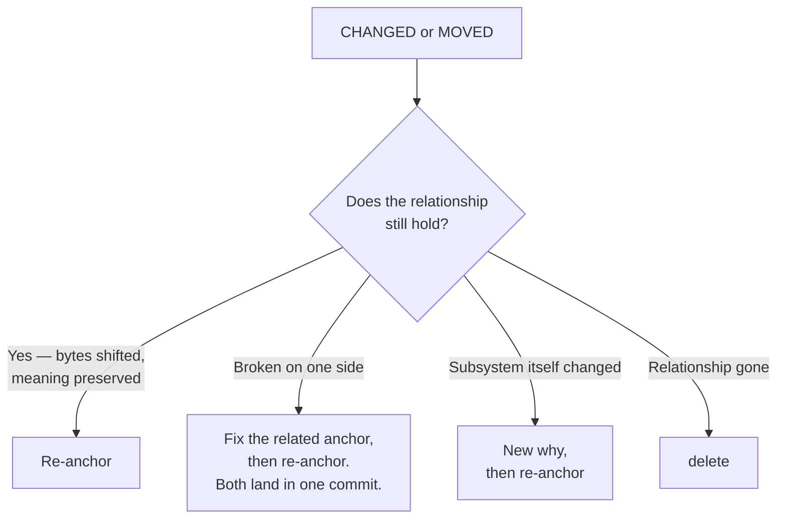

# Responding to drift

A `CHANGED` or `MOVED` finding is a prompt, not a verdict. Decide whether the relationship the mesh describes still holds before reaching for any command. When many meshes drift at once, use the structured batch approach in § "Batch recovery" below — per-mesh confirmation is still required, but categorization and ordering make it tractable. Bulk loops that re-add every recorded anchor verbatim are an anti-pattern: they convert "this needs review" into a clean exit code without anyone confirming the relationship survived. See `./terminal-statuses.md` § "DELETED" for the same warning when an anchored path has vanished.

## Confirming the relationship is a concrete step, not a state of mind

Before any re-anchor command, do this:

1. Run `git mesh why <name>` and read the recorded relationship.
2. Read the file at each recorded `path#L<start>-L<end>` (whole file, for whole-file anchors). Use the `Read` tool — do not infer from filenames or memory.
3. **Write one sentence** stating what relationship the current bytes at those anchors form. If you cannot write that sentence from what you just read, you have not confirmed; stop and inspect further, or `delete` the mesh.

Only after that sentence exists does a re-anchor command apply. The commands below assume this step is done.

### User shorthand does not skip this step

Instructions like "just re-add the anchors", "don't try to recover orphans, re-anchor at current bytes", or "this is taking too long, batch it" remove the *recovery* step (fetch, dig up the lost commit), not the *per-mesh confirmation* step. Bulk re-add over `git mesh list --porcelain` is still the anti-pattern even when the user's phrasing sounds like a green light for it. If the user's instruction and this section appear to conflict, surface the conflict — do not resolve it silently by dropping the confirmation.



## Batch recovery

When `git mesh stale` surfaces dozens or hundreds of findings, process them in structured passes rather than one-at-a-time:

**1. Export to JSON and categorize.** Parse `git mesh stale --format json` into a script. Group findings by mesh name and tag each mesh by its anchor types: whole-file-only, line-range-only, or mixed.

**2. Order by difficulty.** Process in this order:
- **Line-range-only meshes first** — fastest to confirm and re-add.
- **MOVED anchors next** — `git mesh remove` the old span, `git mesh add` the new one.
- **Whole-file-only meshes last** — require reading the full file to confirm the relationship.

**3. Edit all anchors for a mesh in one command.** `git mesh add <name> <anchor1> <anchor2> ...` accepts multiple anchors. One `add` per mesh, not one per anchor.

**4. Run independent `git mesh add` calls in parallel.** Meshes that don't share a mesh file can be edited concurrently (up to ~6 at a time). A mesh that fails to write won't affect others.

**5. Commit in bulk.** After every mesh file is edited and confirmed, persist them all in one commit:
```bash
git add .mesh && git commit -m "Re-anchor drifted meshes"
```

**6. Re-edit if you pinned the wrong span.** A mesh edit is just the working-tree file; a later `git mesh add` over the same `(path, extent)` supersedes the earlier one (last-write-wins). To discard *all* uncommitted mesh edits and start over:
```bash
git checkout -- .mesh                          # drop every uncommitted mesh edit
git mesh add <name> '<path>#L<new-start>-L<new-end>'
```

The per-mesh confirmation step (§ "Confirming the relationship") still applies. Categorization and ordering reduce the overhead of applying it at scale; they do not replace it.

## When the relationship still holds: re-anchor

**Same `(path, extent)`, bytes changed.** A second `git mesh add` over the identical span is a re-anchor (last-write-wins) — it rewrites that anchor's recorded hash in `.mesh/<name>` to current bytes. No `remove` required.

```bash
git mesh add <name> 'server/routes.ts#L13-L34'
git add .mesh && git commit -m "Re-anchor <name>"
```

**Different line span — the anchor moved.** A span that does not exactly match an existing anchor is treated as *new*. Remove the old first:

```bash
git mesh remove <name> 'server/routes.ts#L13-L34'
git mesh add    <name> 'server/routes.ts#L15-L36'
git add .mesh && git commit -m "Move <name> anchor"
```

This is the only time `git mesh remove` appears in a re-anchor workflow. Otherwise, `remove` only removes an anchor from the mesh entirely.

**`MOVED` with identical bytes.** Usually leave it — the anchor follows. Re-anchor only if the new location is the one the mesh should point at going forward.

## When the related code or doc is broken: fix, then re-anchor

The bytes changed and one side now contradicts the other (e.g., the request shape moved but the parser did not). Fix the broken side first, then re-anchor. Both sides should land in the same commit so history shows the relationship was kept whole.

## When the subsystem itself changed: new why, then re-anchor

The why is inherited across routine re-anchors — it carries forward unchanged because `git mesh add` does not touch the why text in the mesh file. Write a new why **only when the subsystem itself changes** — not as a changelog. Write it as a durable answer to "what subsystem do these anchors form?". Caveats, invariants, ownership, and review triggers belong in source comments, commit messages, CODEOWNERS, and PR descriptions.

```bash
git mesh why <name> -m "Token verification flow that lets the API trust a request bearer signed by the auth service."
git add .mesh && git commit -m "Redefine <name> after subsystem change"
```

## When the relationship no longer exists: delete

```bash
git mesh delete <name>                    # remove .mesh/<name>
git add .mesh && git commit -m "Retire <name> mesh"
```

To restore a prior correct mesh state, use ordinary git history — the mesh is a tracked file: `git checkout <commit-ish> -- .mesh/<name>` (then commit), or `git revert` the commit that broke it. `git mesh move <old> <new>` renames a mesh; see `./command-reference.md` § "Structural".

## Prose meshes drift more often than code

Prose anchors (ADRs, contracts, runbooks, API docs) churn for editorial reasons that don't change meaning: prettier or dprint reflow, heading renumbers, sentence rewrites, link sweeps. The current drift detector is line-range + blob-OID; it has no sense of "the meaning is preserved." Expect prose meshes to surface `CHANGED` more often than code meshes.

Defaults for prose meshes:
- **Whole-file anchor** when the document is consumed as a unit (license, one-page ADR, published RFC). `CHANGED` then means "the bytes of this document are not what they were when you pinned it" — a real prompt to reread.
- **Line-range anchor** only when the doc has stable structural landmarks (numbered ADRs, contract clauses, threat-model items with stable IDs) and the team accepts re-anchoring on editorial passes.
- **`ignore_whitespace = true`** in the mesh's `[config]` block is usually right for prose — Markdown reflow is whitespace-shaped within a paragraph. It does not help when reflow moves lines across paragraphs.

When a prose `CHANGED` finding fires, run the same decision tree above. Editorial-only changes that preserve meaning re-anchor unchanged; a doc that now says something different needs the related side fixed first; a wholesale rewrite is the moment to ask whether the relationship survives at all.

## Resolver config

Resolver options live in a `[config]` block at the tail of the mesh file
(`copy_detection`, `ignore_whitespace`, `follow_moves`). They are read by
`git mesh show <name>` and changed by editing `.mesh/<name>` directly and
committing it. There is no `git mesh config` subcommand. See
`./command-reference.md` § "Configuration" for keys, values, and defaults.
