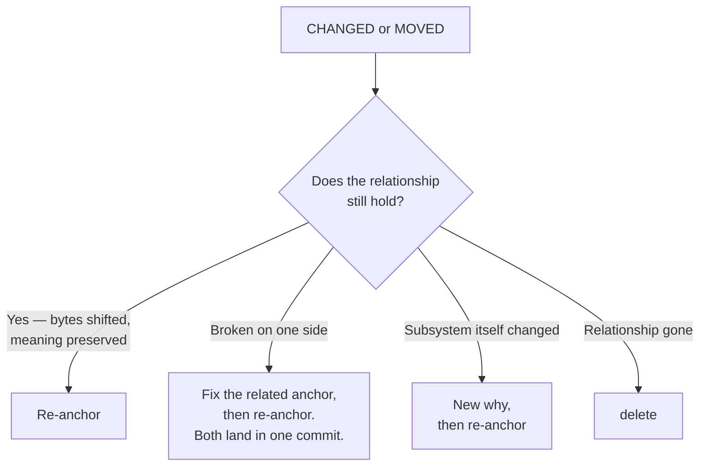

# Responding to drift

A `CHANGED` or `MOVED` finding is a prompt, not a verdict. Decide whether the relationship the span describes still holds before reaching for any command. When many spans drift at once, use the structured batch approach in § "Batch recovery" below — per-span confirmation is still required, but categorization and ordering make it tractable. Bulk loops that re-add every recorded anchor verbatim are an anti-pattern: they convert "this needs review" into a clean exit code without anyone confirming the relationship survived. See `./terminal-statuses.md` § "DELETED" for the same warning when an anchored path has vanished.

## Confirming the relationship is a concrete step, not a state of mind

Before any re-anchor command, do this:

1. Run `git span why <name>` and read the recorded relationship.
2. Read the file at each recorded `path#L<start>-L<end>` (whole file, for whole-file anchors). Use the `Read` tool — do not infer from filenames or memory.
3. **Write one sentence** stating what relationship the current bytes at those anchors form. If you cannot write that sentence from what you just read, you have not confirmed; stop and inspect further, or `delete` the span.

Only after that sentence exists does a re-anchor command apply. The commands below assume this step is done.

### User shorthand does not skip this step

Instructions like "just re-add the anchors", "don't try to recover orphans, re-anchor at current bytes", or "this is taking too long, batch it" remove the *recovery* step (fetch, dig up the lost commit), not the *per-span confirmation* step. Bulk re-add over `git span list --porcelain` is still the anti-pattern even when the user's phrasing sounds like a green light for it. If the user's instruction and this section appear to conflict, surface the conflict — do not resolve it silently by dropping the confirmation.



## Batch recovery

When `git span stale` surfaces dozens or hundreds of findings, process them in structured passes rather than one-at-a-time:

**1. Export to JSON and categorize.** Parse `git span stale --format json` into a script. Group findings by span name and tag each span by its anchor types: whole-file-only, line-range-only, or mixed.

**2. Order by difficulty.** Process in this order:
- **Line-range-only spans first** — fastest to confirm and re-add.
- **MOVED anchors next** — `git span remove` the old extent, `git span add` the new one.
- **Whole-file-only spans last** — require reading the full file to confirm the relationship.

**3. Edit all anchors for a span in one command.** `git span add <name> <anchor1> <anchor2> ...` accepts multiple anchors. One `add` per span, not one per anchor.

**4. Run independent `git span add` calls in parallel.** Spans that don't share a span file can be edited concurrently (up to ~6 at a time). A span that fails to write won't affect others. **Never parallelize two `git span add` calls against the *same* span name** — `add` has no locking around its read-modify-write of the span file, so two concurrent calls on one span can silently lose one call's anchors to a last-write-wins race (exit 0, no error, no warning). If two anchors need adding to one span, put them in a single `git span add <name> <anchor1> <anchor2> ...` call, not two concurrent ones.

**5. Commit in bulk.** After every span file is edited and confirmed, persist them all in one commit:
```bash
git add .span && git commit -m "Re-anchor drifted spans"
```

**6. Re-edit if you pinned the wrong extent.** A span edit is just the working-tree file; a later `git span add` over the same `(path, extent)` supersedes the earlier one (last-write-wins), so usually you can simply re-add — no discard needed. To drop *your own* uncommitted edits to one span file and start over, scope the discard to that **named** file:
```bash
git checkout HEAD -- .span/<name>              # restore one named span file to its committed state
git span add <name> '<path>#L<new-start>-L<new-end>'
```

> **Git allowlist when resolving spans.** The worktree may be shared with other agents whose work exists only as uncommitted changes — tracked *or* untracked. So restrict yourself to: `git span …`, `git add .span[/<name>]`, `git commit -m` (never `-a` or `--amend`), `git checkout <commit-ish> -- .span/<name>` (a **named** span file only), and read-only `git status`/`git diff`/`git log`/`git show`. **Forbidden** — any command that touches paths outside `.span/`, rewinds HEAD, or operates on the whole tree: `git add .`, `git commit -a`, `git commit --amend`, `git reset` (any form), `git checkout`/`git restore` with a non-`.span/<name>` pathspec, `git clean`, `git stash`, `git rm`, force-push. They erase shared work irrecoverably and HEAD-rewinding cannot be undone. If a post-commit hook promotes source into a span commit, **stop, change nothing, and report it** (which non-`.span/` paths were committed, the commit SHA) rather than resetting to "undo" the side effect.

The per-span confirmation step (§ "Confirming the relationship") still applies. Categorization and ordering reduce the overhead of applying it at scale; they do not replace it.

## When the relationship still holds: re-anchor

Re-anchoring records the new hash against `HEAD`, so the anchored file must be committed first or in the same commit. If you re-anchored against an edit still in the working tree, commit the source with or before the span — committing the span against uncommitted bytes makes it born stale. See `./creating-a-span.md` § "Commit sequence alongside a code change" for the standard.

**Same `(path, extent)`, bytes changed.** A second `git span add` over the identical extent is a re-anchor (last-write-wins) — it rewrites that anchor's recorded hash in `.span/<name>` to current bytes. No `remove` required.

```bash
git span add <name> 'server/routes.ts#L13-L34'
git add .span && git commit -m "Re-anchor <name>"
```

**Different line extent — the anchor moved.** An extent that does not exactly match an existing anchor is treated as *new*. Remove the old first:

```bash
git span remove <name> 'server/routes.ts#L13-L34'
git span add    <name> 'server/routes.ts#L15-L36'
git add .span && git commit -m "Move <name> anchor"
```

This is the only time `git span remove` appears in a re-anchor workflow. Otherwise, `remove` only removes an anchor from the span entirely.

**`MOVED` with identical bytes.** Usually leave it — the anchor follows. Re-anchor only if the new location is the one the span should point at going forward.

## When the related code or doc is broken: fix, then re-anchor

The bytes changed and one side now contradicts the other (e.g., the request shape moved but the parser did not). Fix the broken side first, then re-anchor. Both sides should land in the same commit so history shows the relationship was kept whole.

## When the subsystem itself changed: new why, then re-anchor

The why is inherited across routine re-anchors — it carries forward unchanged because `git span add` does not touch the why text in the span file. Write a new why **only when the subsystem itself changes** — not as a changelog. Write it as a durable answer to "what subsystem do these anchors form?". Caveats, invariants, ownership, and review triggers belong in source comments, commit messages, CODEOWNERS, and PR descriptions.

```bash
git span why <name> -m "Token verification flow that lets the API trust a request bearer signed by the auth service."
git add .span && git commit -m "Redefine <name> after subsystem change"
```

## When the relationship no longer exists: delete

```bash
git span delete <name>                    # remove .span/<name>
git add .span && git commit -m "Retire <name> span"
```

To restore a prior correct span state, use ordinary git history — the span is a tracked file: `git checkout <commit-ish> -- .span/<name>` (then commit), or `git revert` the commit that broke it. Rename a span by moving the file with `git mv .span/<old> .span/<new>` and committing.

## Prose spans drift more often than code

Prose anchors (ADRs, contracts, runbooks, API docs) churn for editorial reasons that don't change meaning: prettier or dprint reflow, heading renumbers, sentence rewrites, link sweeps. The current drift detector is line-range + blob-OID; it has no sense of "the meaning is preserved." Expect prose spans to surface `CHANGED` more often than code spans.

Defaults for prose spans:
- **Whole-file anchor** when the document is consumed as a unit (license, one-page ADR, published RFC). `CHANGED` then means "the bytes of this document are not what they were when you pinned it" — a real prompt to reread.
- **Line-range anchor** only when the doc has stable structural landmarks (numbered ADRs, contract clauses, threat-model items with stable IDs) and the team accepts re-anchoring on editorial passes.
- **`ignore_whitespace = true`** in the span's `[config]` block is usually right for prose — Markdown reflow is whitespace-shaped within a paragraph. It does not help when reflow moves lines across paragraphs.

When a prose `CHANGED` finding fires, run the same decision tree above. Editorial-only changes that preserve meaning re-anchor unchanged; a doc that now says something different needs the related side fixed first; a wholesale rewrite is the moment to ask whether the relationship survives at all.

## Automating reconciliation: avoid the uncommitted re-anchor loop

A hook or agent that runs `git span stale` on every turn and reacts to drift
must commit the anchored source together with (or before) the span re-anchor —
never re-anchor-and-stage-only while deliberately deferring the source commit
to a human. `stale` has no notion of "already re-anchored to match the current
worktree, just waiting on a source commit": it always resolves all three layers
(HEAD, Index, Worktree), and reports the same drifted status for as long as the
source stays uncommitted, because whichever layer the anchor is repointed to,
some other layer still disagrees. An automation that is only allowed to
re-anchor and stage — not commit the source — cannot reach `FRESH` by
construction, and will re-fire indefinitely on the same drift every time it
runs. If an orchestration layer must gate on a human approving the source
change before it's committed, gate the *hook itself* (e.g. skip re-running
`stale` until the source lands), not the span reconciliation step.

## Resolver config

Resolver options live in a `[config]` block at the tail of the span file
(`copy_detection`, `ignore_whitespace`, `follow_moves`). They are read by
`git span show <name>` and changed by editing `.span/<name>` directly and
committing it. There is no `git span config` subcommand. See
`./command-reference.md` § "Configuration" for keys, values, and defaults.
